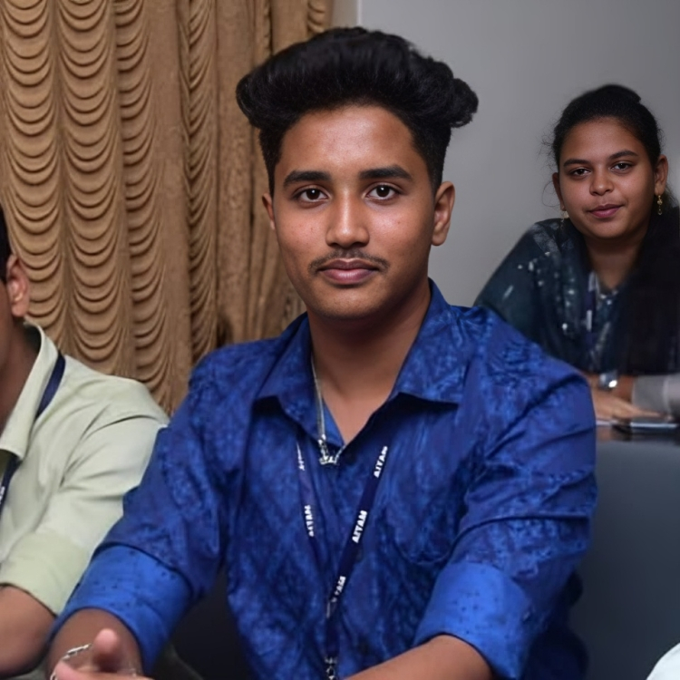

# ✦ Yuvraj's Developer Portfolio

**A modern, responsive developer portfolio built with React + Vite**

[🌐 Live Demo](https://dhanal-yuvraj.netlify.app/) &nbsp;·&nbsp; [📄 Resume](public/Yuvraj_Resume.pdf) &nbsp;·&nbsp; [🐛 Report Bug](https://github.com/yuvraj/yuvraj-portfolio/issues)

---

## 📸 Preview

| Home | Education | Projects |
|------|-----------|----------|
|  |  |  |

| Skills | Contact |
|--------|---------|
|  |  |

---

## ✨ Features

- ⚡ **Blazing Fast** — Built with Vite for instant HMR and optimized builds
- 📱 **Fully Responsive** — Pixel-perfect on mobile, tablet, and desktop
- 🎨 **Modern Dark Theme** — Deep blue aesthetic with smooth animations
- ✍️ **Typing Animation** — Dynamic role display on the hero section
- 📧 **Working Contact Form** — EmailJS integration, messages go straight to inbox
- 📄 **Resume Download** — One-click CV download from the hero section
- 🎓 **Education Timeline** — Animated timeline with CGPA and scores
- 💼 **Projects Showcase** — Cards with tech stack, GitHub and live demo links
- 🛠️ **Skills & Coding Profiles** — Progress bars + LeetCode, GFG, GitHub, LinkedIn
- 🔗 **Social Links** — All profiles connected in one place

---

## 🗂️ Project Structure
